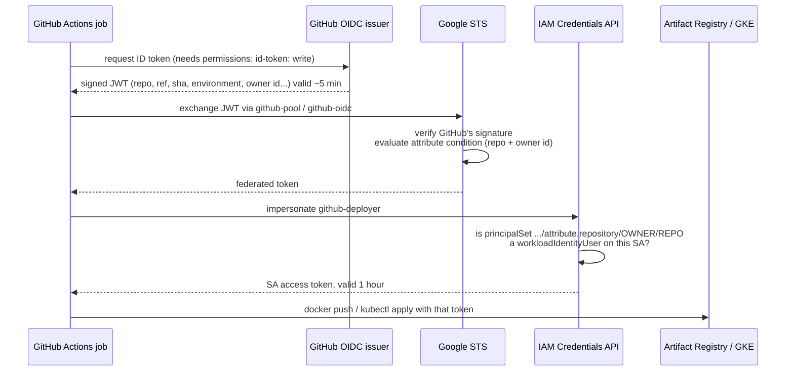

# How GitHub Actions logs in to Google Cloud without a key — and how pods do too

**Author: Sanjay Naidu**

Project 6 uses **two** keyless identity flows. They look similar and are easy to mix up in an interview, so this note puts them side by side.

| | Flow 1: GitHub Actions → GCP | Flow 2: a pod → Secret Manager |
|---|---|---|
| Who proves identity | a GitHub workflow run | a Kubernetes ServiceAccount |
| Token issuer | `token.actions.githubusercontent.com` | the GKE cluster itself |
| Trust object | **Workload Identity *Federation*** pool `github-pool` (you create it, Phase 10) | **Workload Identity Federation *for GKE*** pool `<PROJECT_ID>.svc.id.goog` (created with the cluster) |
| Becomes | the `github-deployer` service account (impersonation) | the principal `…/namespace/medicart-prod` itself (no service account) |
| Can do | push images, deploy to the cluster | read this environment's two secrets |

---

## Flow 1: GitHub Actions → Google Cloud

### The problem

The pipeline must push images and deploy, so it needs Google credentials. The old way was to create a service-account **JSON key**, paste it into a GitHub secret, and hope it never leaks. Such a key never expires on its own, works from anywhere, and ends up copied into laptops and CI logs. Workload Identity Federation removes the key entirely.

### The flow



`google-github-actions/auth` does all of this in one step (inside `.github/actions/gke-deploy`). After it, `gcloud`, `docker` and `kubectl` in the job are logged in.

### What you created in the console (Phase 10), and what each piece does

| Console item | What it is |
|---|---|
| **Pool** `github-pool` | A container for identities from outside Google. |
| **Provider** `github-oidc` | "Trust JWTs signed by `https://token.actions.githubusercontent.com`." |
| **Attribute mapping** | Copies JWT claims into Google attributes: `attribute.repository = assertion.repository`, and so on. |
| **Attribute condition** | The gate: `assertion.repository == 'Sanjay-Naidu/project6-…' && assertion.repository_owner_id == '<id>'`. Tokens from any other repo are rejected at STS, before any service account is involved. |
| **Grant access (impersonation)** | Grants `roles/iam.workloadIdentityUser` on `github-deployer` to `principalSet://…/attribute.repository/Sanjay-Naidu/project6-…`. |

**Why the numeric owner id too:** if I ever renamed my GitHub account and someone registered `Sanjay-Naidu`, their repo could have the same *name*. It could not have the same numeric id.

### Coming from Azure (Projects 3–4)

| | Azure | GCP |
|---|---|---|
| Trust object | Federated credential on an Entra ID app registration | Workload identity pool + OIDC provider |
| Matching | The exact `subject` string, one credential per subject (`ref:refs/heads/main`, `environment:prod`, …) | A **CEL expression** over any claim; one condition on `repository` covers every job |
| Adding `environment: prod` to a job | Changes the subject, so you need a new federated credential (`AADSTS700213` otherwise) | Nothing to change |
| Identity used | the app's service principal | a service account, impersonated |

### Hardening options

- **Split dev/prod deployers.** Map `attribute.environment = assertion.environment` and bind a *prod-only* SA to `principalSet://…/attribute.environment/prod`. Then only the approval-gated `prod` job can touch prod.
- **Main branch only.** Add `&& assertion.ref == 'refs/heads/main'` to the condition.

---

## Flow 2: a pod → Secret Manager (Workload Identity Federation for GKE)

When `medicart-prod`'s app pod starts, the **Secret Manager add-on** (a CSI driver on the node) asks the cluster for a token for the pod's Kubernetes ServiceAccount `medicart`. It exchanges that token with Google STS through the cluster's built-in pool `<PROJECT_ID>.svc.id.goog`, and reads the secret **as that identity**. The pod never holds a Google credential. It just sees two files in `/var/run/secrets/medicart/`.

In Phase 8 you granted *Secret Manager Secret Accessor* to:

```
principalSet://iam.googleapis.com/projects/<NUMBER>/locations/global/workloadIdentityPools/<PROJECT_ID>.svc.id.goog/namespace/medicart-prod
```

That means *every ServiceAccount in namespace medicart-prod*, and only on the prod secrets. Dev pods run in `medicart-dev`, so they are a different principal: they can't read prod secrets even if someone points a dev manifest at them.

Note there is **no Google service account** in this flow. Older GKE guides create one and annotate the Kubernetes SA with `iam.gke.io/gcp-service-account`. Granting IAM roles directly to the Kubernetes identity is the current approach, with one less object to manage.

---

## Verifying it in the console

- *IAM & Admin → Workload Identity Federation → github-pool*: the provider and its condition.
- *IAM & Admin → Service Accounts → github-deployer → Principals with access*: the `principalSet` binding.
- *Secret Manager → medicart-prod-db-password → Permissions*: the namespace principal.
- *Logging → Logs Explorer*: `protoPayload.serviceName="sts.googleapis.com"` shows every token exchange (enable Data Access audit logs for the *Security Token Service API* first; they're off by default).
